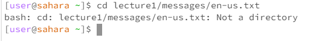
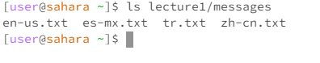
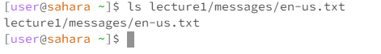
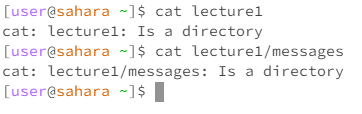
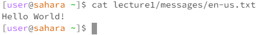

# CSE 15L - Lab Report 1 - Alexander Zhen

> `cd` command, an example of using the command with *no* arguments.

* The working directory when the command was run was in the */home* directory.
* When I typed in the `cd` command in the home directory without an argument (or no indication of paths I want to change to), it would just redirect me back to the home directory, as that is the current working directory with no argument.
* It is not an error, as it just points to the current working directory, which is the home directory.

> `cd` command, an example of using the command with a path to a *directory* as an argument.

* The working directory when the command was run was in the */home* directory.
* When I typed in the `cd` command in the home directory, using a path to a directory as an argument, it switches my current directory (home) to the *lecture1* directory.
* It is not an error, because it changed from the **home** directory to the *lecture1* directory and is ready for input for that particular directory.

> `cd` command, an example of using the command with a path to a *file* as an argument.

* The working directory when the command was run was also in the */home* directory.
* Using the `cd` command with a path to a file as an argument gave me an error that stated *lecture1/messages/en-us.txt is not a directory*. The reason I received that error is because the `cd` command only switches from directory to directory, therefore creating a path to a file using the `cd` command would not work.
* Therefore, this output is an error, because the `cd` command cannot access a path to a file, as it only helps switch directories. 

---

> `ls` command, an example of using the command with no arguments.

* The working directory when the command `ls` was run was in the */home* directory.
* With the `ls` command used in the *home* directory, is gave me the output of *lecture1*, because the `ls` command is used to list files and folders. In this case, `ls` was used in the *home* directory with no arguments, therefore it would list the available folder, which is *lecture1*.
* This would not be an error, because it is simply just listing the folder from the current working directory.

> `ls` command, an example of using the command with a path to a *directory* as an argument.

* The working directory when I ran the command `ls` with a path to a directory was in the */home* directory.
* Using the `ls` command with a path to a directory, in this case the *messages* directory, it gives us an output of the list of files within that directory, which were the txt files.
* This would not be an error, as it lists the files from the given path.
  
> `ls` command, an example of using the command with a path to a *file* as an argument.

* The working directory when I ran the command `ls` with a path to a file was in the */home* directory.
* When creating a path using `ls` to a file, it gave me the output of the path to the file, *lecture1/messages/en-us.txt*. I got that output because using the `ls` command with a path to a file as an argument will give us the path of the file instead of what was written in the txt file.
* This would not be an error, because the `ls` command is used to list both the files and folders of a given path, therefore it would just list the path of the file instead of what is in it.

---

> `cat` command, an example of using the command with no arguments.

* The working directory used was the */home* directory for the `cat` command with no arguments.
* When using the `cat` command in the home working directory, it would not give an output. This is because the `cat` command is used for printing out the contents of a file, so when I used it in the home directory, where there aren't any files, it would not show anything.
* This would not be an error, because using the `cat` command without an argument, as well as in the working directory with no printable files, means that there aren't any files to print out, just simply user error.

> `cat` command, an example of using the command with a path to a *directory* as an argument.

* The working directory used was in the */home* directory for the `cat` command with a path to a directory as an argument.
* Using the `cat` command with a path to a directory as an argument gave me an output of *"... is a directory"*. This is because the `cat` command is used for printing out contents of a file, therefore when using a path to a directory as an argument, it would give us an error, basically explaining to us "hey, we need a file, not a directory".
* Therefore, this output would be an error, because the `cat` command would print out contents of a file, not a directory.

> `cat` command, an eaxample of using the command with a path to a *file* as an argument.

* The working directory used was in the */home* directory for the `cat` command with a path to a file as an argument.
* Using the `cat` command with a path to a file as an argument gave us the contents of that specific file. In this case, the path was *lecture1/messages/en-us.txt* and that gave us the output of "Hello World!", which is the contents within that specific file (en-us.txt).
* This would not be an error, because the `cat` command did print out the contents of a given path to a file.  
---
